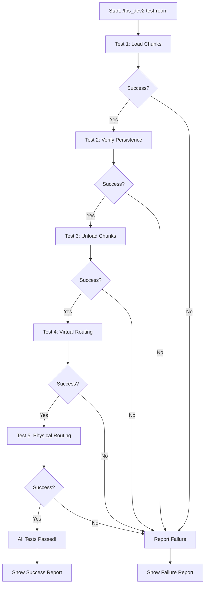

# Dev 2 QA Testing Tools - Summary

**Module**: Dev 2 - Chunk Manager & Interceptor
**Status**: ✅ Ready for QA Testing
**Created**: 2026-03-27

---

## Quick Start for QA Testers

### 1. Start Minecraft with the Mod

```bash
# Ensure you have:
- Minecraft 1.21.11
- NeoForge 21.11.38-beta
- FPSCompress mod installed
- Compact Machines 7.0.81 installed
```

### 2. Get OP Permissions

```
/op <your_username>
```

### 3. Run Quick Test

```
/fps_dev2 test-room <YOUR_ROOM_CODE>
```

**Expected Output**:
```
[Dev2 Test] Running comprehensive test for room: <code>
[1/5] Testing chunk loading...
  ✓ Chunks loaded successfully
[2/5] Verifying chunk persistence...
  ✓ Chunks remain loaded
[3/5] Testing chunk unloading...
  ✓ Chunks unloaded successfully
[4/5] Testing virtual routing...
  ✓ Routing set to VIRTUAL
[5/5] Testing physical routing...
  ✓ Routing set to PHYSICAL
[Dev2 Test] Results: 5/5 tests passed ✓ ALL TESTS PASSED
```

---

## Files for QA Team

### 📋 Documentation

1. **`QA_TESTING_GUIDE_DEV2.md`** - Comprehensive testing guide
   - Detailed test procedures
   - Expected results
   - Troubleshooting steps
   - Test report template

### 🔧 Test Commands

Available in-game via `/fps_dev2`:

| Command | Purpose | Time |
|---------|---------|------|
| `/fps_dev2 test-room <code>` | **Quick automated test** | 30 sec |
| `/fps_dev2 chunks <code> <true\|false>` | Manual chunk loading test | 10 sec |
| `/fps_dev2 routing <true\|false>` | Manual routing test | 5 sec |
| `/fps_dev2 diagnostics` | Show current state | 5 sec |
| `/fps_dev2 cleanup` | Clean up after tests | 5 sec |

### 📜 Scripts

**For Windows** (`test_dev2.ps1`):
```powershell
# Copy commands to clipboard
.\test_dev2.ps1 -RoomCode "your_room_code"
```

**For Linux/Mac** (`test_dev2.sh`):
```bash
# Display test sequence
./test_dev2.sh your_room_code
```

---

## Test Coverage

### ✅ Unit Tests (Automated via `/fps_dev2 test-room`)

| Test | What It Checks | Pass Criteria |
|------|----------------|---------------|
| Chunk Loading | Chunks load when requested | Chunks are loaded |
| Chunk Persistence | Chunks stay loaded | Chunks remain loaded |
| Chunk Unloading | Chunks unload when requested | Chunks are unloaded |
| Virtual Routing | Routing switches to virtual | State = VIRTUAL |
| Physical Routing | Routing switches to physical | State = PHYSICAL |

### 🔄 Integration Tests (Manual)

| Test | What It Checks | Status |
|------|----------------|--------|
| State Machine Integration | Works with FactoryIntegrator | Depends on Dev 4 |
| Resource Routing | Items route correctly | Depends on Dev 1 |
| Chunk Loading Leaks | No memory leaks | ✅ Testable now |

---

## Command Implementation

### Class: `Dev2TestCommands.java`

**Location**: `src/main/java/com/mukulramesh/fpscompress/debug/Dev2TestCommands.java`

**Features**:
- ✅ Color-coded output (green = success, red = fail)
- ✅ Detailed test results
- ✅ Automatic test sequencing
- ✅ Error handling and logging
- ✅ State verification

**Security**:
- ⚠️ Requires OP level 2
- ⚠️ Should be disabled in production builds
- ✅ All tests are non-destructive (read-only state checks)

---

## Test Execution Flow



---

## Expected Test Duration

| Activity | Time | Difficulty |
|----------|------|------------|
| **Setup** (first time) | 5 min | Easy |
| **Quick automated test** | 30 sec | Very Easy |
| **Full manual tests** | 15 min | Easy |
| **Integration tests** | 10 min | Medium |
| **Bug investigation** | varies | Varies |

**Total QA Time**: ~20-30 minutes for comprehensive testing

---

## Success Criteria

### ✅ All Tests PASS If:

1. **Chunk Management**:
   - ✓ Chunks load when requested
   - ✓ Chunks unload when requested
   - ✓ No chunk loading leaks (cleanup works)
   - ✓ Chunks load at correct coordinates (not placeholder)

2. **Routing State**:
   - ✓ Routing toggles between VIRTUAL and PHYSICAL
   - ✓ State persists between checks
   - ✓ Diagnostics show correct state

3. **Diagnostics**:
   - ✓ Output is formatted correctly
   - ✓ Values are accurate
   - ✓ Updates in real-time

4. **Cleanup**:
   - ✓ All chunk tickets removed
   - ✓ State resets properly
   - ✓ No memory leaks

### ❌ FAIL If:

- ❌ Any test in automated suite fails
- ❌ Chunks don't load/unload
- ❌ Routing state doesn't change
- ❌ Chunk loading leaks detected
- ❌ Server crashes or errors

---

## Known Limitations

### Current Limitations

1. **Compact Machines API**:
   - Uses reflection (may break with CM updates)
   - Explicit error logging when reflection fails
   - **Not a silent failure** - will log ERROR clearly

2. **Single Interceptor Instance**:
   - Test commands use singleton pattern
   - Not suitable for production multi-machine testing
   - Works fine for QA validation

3. **No GUI**:
   - All tests are command-based
   - Requires console/chat access
   - Good for automation, less intuitive for non-technical QA

### Future Improvements

1. **GUI Test Panel**: Add in-game UI for testing (post v1.0)
2. **Automated Test Runner**: Script to run all tests automatically
3. **Performance Metrics**: Track chunk load/unload times
4. **Multi-Machine Testing**: Test multiple factories simultaneously

---

## Troubleshooting Quick Reference

| Issue | Quick Fix |
|-------|-----------|
| "Room code not found" | Verify room exists with CM commands |
| Chunks don't load | Check server logs for ERROR about coordinates |
| Routing doesn't change | Run `/fps_dev2 cleanup` and retry |
| Command not found | Verify mod loaded: check `/fps_dev2` shows syntax |
| Chunk loading leak | Run `/fps_dev2 cleanup` to force cleanup |
| Server crash | Check logs, report bug with diagnostics output |

**For detailed troubleshooting**, see `QA_TESTING_GUIDE_DEV2.md` section "Troubleshooting"

---

## Communication with Dev Team

### Bug Report Format

When reporting bugs, include:

1. **What command you ran**:
   ```
   /fps_dev2 test-room room_abc123
   ```

2. **What happened** (with screenshot):
   ```
   [1/5] Testing chunk loading...
     ✗ Chunks failed to load
   ```

3. **Diagnostics output**:
   ```
   /fps_dev2 diagnostics
   ```

4. **Server log snippet** (last 20 lines with ERROR/WARN)

5. **Environment**:
   - Minecraft version
   - Mod version
   - CM version
   - Other mods installed

### Expected Response Time

- **Critical** (server crash): Immediate investigation
- **High** (test failures): 24-48 hours
- **Medium** (UI issues): 1 week
- **Low** (enhancement): Next release

---

## Approval Checklist

Before approving Dev 2 for release:

- [ ] `/fps_dev2 test-room` shows 5/5 tests passed
- [ ] Manual chunk loading test works
- [ ] Manual chunk unloading test works
- [ ] Routing state toggles correctly
- [ ] Diagnostics show accurate information
- [ ] Cleanup removes all chunk tickets
- [ ] No server errors in logs
- [ ] No chunk loading leaks detected
- [ ] CM room coordinates resolved (not using placeholders)
- [ ] Integration tests pass (if Devs 1 & 4 complete)

**Sign-Off**:
```
QA Tester: ___________________
Date: ________________________
Status: APPROVED / REJECTED
```

---

## Additional Resources

- **Dev 2 Implementation**: See `DEV2_IMPLEMENTATION.md`
- **CM API Integration**: See `CM_API_INTEGRATION.md`
- **Full Integration**: See `DEV2_INTEGRATION_COMPLETE.md`
- **Architecture**: See `CLAUDE.md` (Module 3: Spatial Manager)

---

**Questions?** Contact Dev 2 team with test results and diagnostics output.
